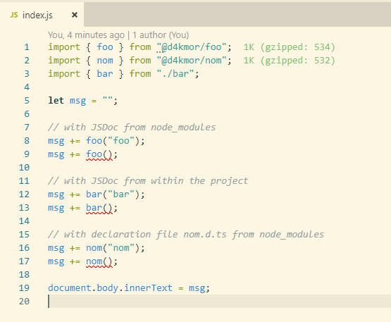
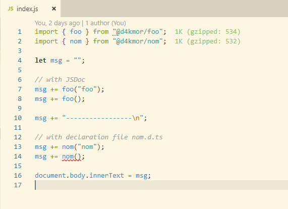

# Testing JsDoc for Intellisense & Type Linting with typescript

Setup:
```bash
git clone ...
cd jsdoc-intellisense
yarn install
```

## Live linting via IDE

Works perfectly fine when using a `jsconfig.json`.


JsDocs only linting stops if a `tsconfig.json` exists.



## Linting to be used in a CI

Typescript ignores JsDoc types from node_modules.
JsDoc types from files within the repository are fine.

Run
```bash
tsc
```

### Expected

Error "An argument for 'name' was not provided." for
```
msg += foo();
msg += bar();
msg += nom();
```

### Actual

Error "An argument for 'name' was not provided." for
```
msg += bar();
msg += nom();
```
