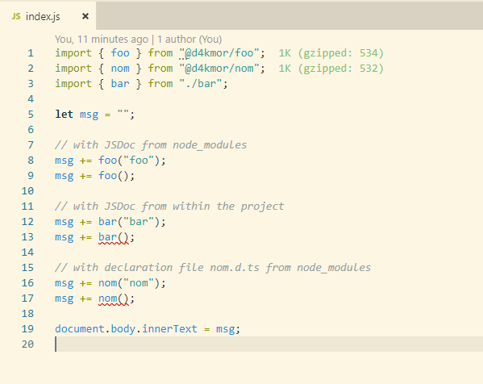

# Testing JsDoc for Intellisense & Type Linting with typescript

Setup:
```bash
git clone https://github.com/daKmoR/jsdoc-intellisense.git
cd jsdoc-intellisense
yarn install
```

## Live linting via IDE

- Works perfectly fine when using a [jsconfig.json](https://github.com/daKmoR/jsdoc-intellisense/blob/master/jsconfig.json).<br>
  

- JsDocs only linting stops if a [tsconfig.json](https://github.com/daKmoR/jsdoc-intellisense/blob/master/tsconfig.json) exists.<br>
  

## Linting to be used in a CI

- Typescript ignores JsDoc types from node_modules.
- JsDoc types from files within the repository are fine.

Run
```bash
tsc
```
Note: Using a [tsconfig.json](https://github.com/daKmoR/jsdoc-intellisense/blob/master/tsconfig.json) or providing the needed parameters via cli did not make a difference.

### Expected

Error "An argument for 'name' was not provided." for
```
msg += foo();
msg += bar();
msg += nom();
```

### Actual

Error "An argument for 'name' was not provided." for
```
msg += bar();
msg += nom();
```
